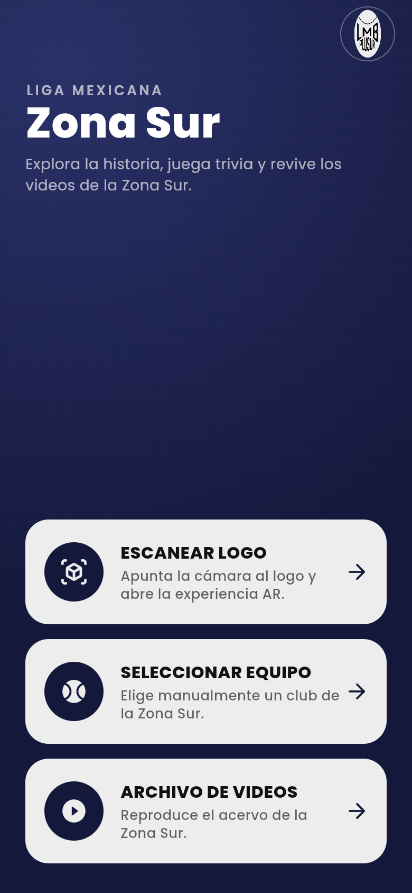
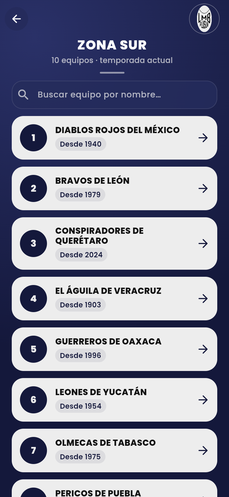
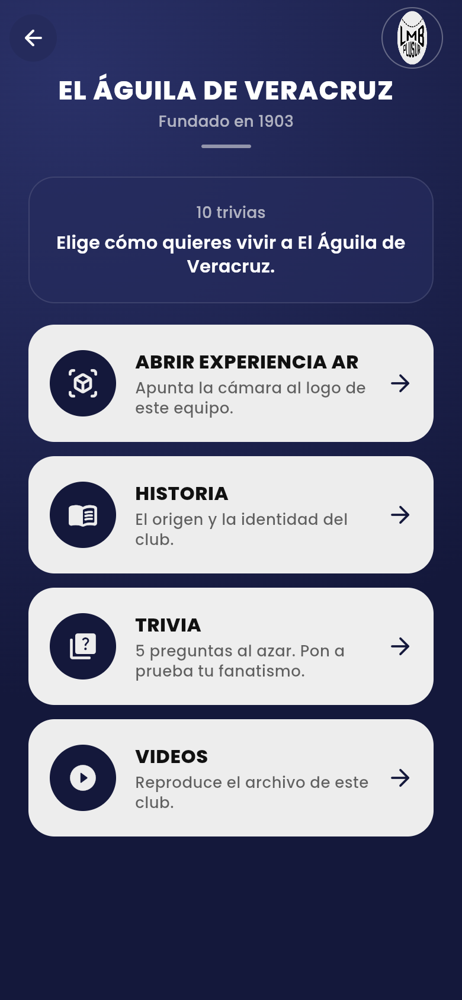
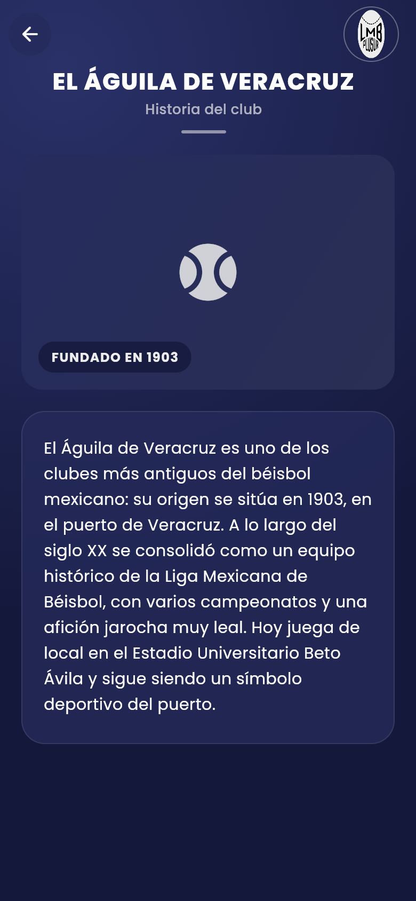
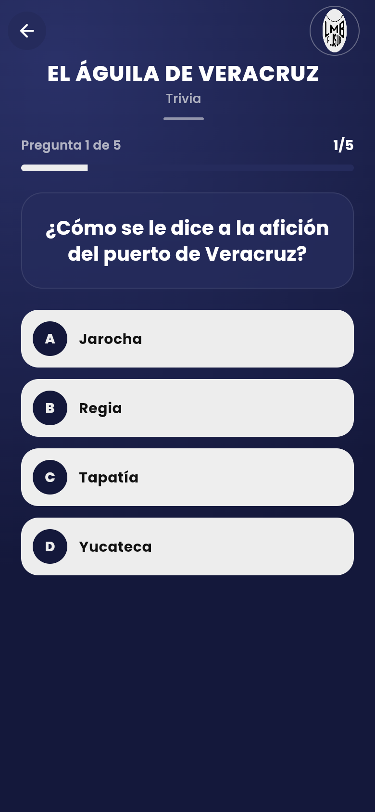
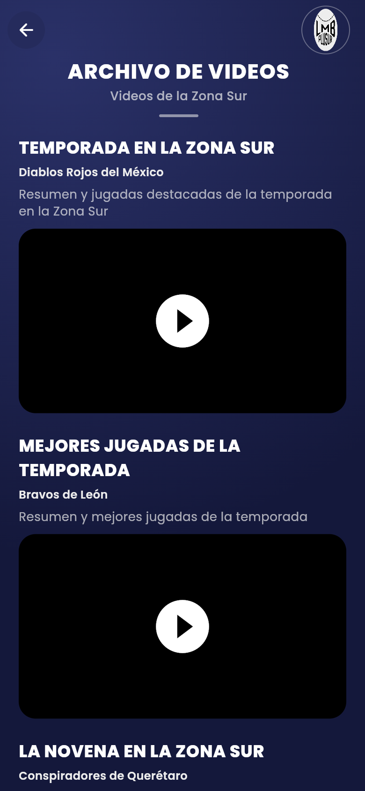

<p align="center">
  
</p>

<h1 align="center">LMB Plusur</h1>

<p align="center">
  <strong>Flutter companion for Liga Mexicana de Béisbol — Zona Sur</strong><br />
  Scan a club logo to open AR, or browse every southern-division team by name.
</p>

<p align="center">
  
  
  
  
  
</p>

**LMB Plusur** is a local-first Android app for fans of the ten **Zona Sur** clubs. It pairs a native ARCore scan path with a full team encyclopedia: club history, five-question trivia, and a highlight archive with on-device preview filters.

The product UI is in **Spanish**. There is no login, no API, and no cloud account — content ships in the APK, and the last trivia score stays on the device.

---

## Screenshots

<p align="center">
  
  
  
</p>

<p align="center">
  
  
  
</p>

> **About these images.** The shipping product is a **mobile Android app**. The gallery was captured from the Flutter **web** build at a 390×844 phone viewport so the layout matches a handset. The live AR camera session is **not** shown — logo tracking needs a physical device with [Google Play Services for AR](https://play.google.com/store/apps/details?id=com.google.ar.core) and is not available in the browser.

| Screen | What you see |
|---|---|
| Home | Three entry points: scan a logo, pick a club, or open the video archive |
| Zona Sur | Searchable list of the ten southern-division clubs |
| Club menu | History, trivia, club videos, and **Abrir experiencia AR** |
| Historia | Founding year and the club narrative |
| Trivia | Five random questions with immediate feedback |
| Archivo de videos | One highlight per club, with optional preview filters |

---

## What you can do

**Scan a printed club logo.** Capable Android devices start a real ARCore session (Augmented Images). When the tracker locks, the app places that club’s 3D model on the logo and offers in-session actions — celebration, spoken club info, and a home-run effect.

**Browse without a camera.** Search the Zona Sur roster, open a club, and use history, trivia, and videos even if AR is unavailable. The failure panel always offers a way back to the manual path.

**Play trivia.** Each club has a question bank. A round is five random items; the last score is saved locally and shown the next time you open that club.

**Watch the archive.** Highlights load from a local catalog of public YouTube URLs. Preview filters run on the device: blur, pixelate, thermal, color grade, soft, pastels, and high saturation.

---

## Zona Sur clubs

| Club | Founded |
|---|---|
| Diablos Rojos del México | 1940 |
| Bravos de León | 1979 |
| Conspiradores de Querétaro | 2024 |
| El Águila de Veracruz | 1903 |
| Guerreros de Oaxaca | 1996 |
| Leones de Yucatán | 1954 |
| Olmecas de Tabasco | 1975 |
| Pericos de Puebla | 1938 |
| Piratas de Campeche | 1980 |
| Tigres de Quintana Roo | 1955 |

Scope is Zona Sur only — no Zona Norte clubs and no soccer branding.

---

## How it is built

The app is **Flutter-first**. Dart owns navigation, chrome, content, and filters. Native ARCore owns detection and pose. Flutter never inspects camera frames to guess a logo; the tracker reports a reference-image name, and the app resolves it with an exact lookup.

```
UI  (screens, overlays, Spanish chrome)
 └─ ArSessionController  — sealed session states
     └─ ArTracker        — production: ARCore · tests/demo: fake tracker
         └─ MarkerRegistry + assets/ar_markers.json
```

| Piece | Choice |
|---|---|
| UI | Flutter 3 / Dart 3, Material 3, Poppins, navy + cream |
| Content | `assets/data.json` (10 clubs), `assets/videos.json` |
| Persistence | `shared_preferences` — last trivia score only |
| AR | `ar_flutter_plugin_plus` **1.1.3** (exact pin) → ARCore Augmented Images |
| 3D | Low-poly GLBs in-session (stadium, player, trophy, VFX) — not a WebView |
| Video | `youtube_player_iframe` + on-device `FilterEngine` |
| Backend | None |

AR is optional at the platform level. If Play Services for AR is missing, or the user denies the camera, the session fails closed with Spanish recovery copy instead of faking a lock.

---

## Getting started

**Requirements**

- Flutter **3.47+** / Dart **3.13+**
- **JDK 17** for Android builds
- Physical Android, `minSdk` **24**, with Google Play Services for AR (for the scanner)
- PowerShell 5.1 on Windows — chain commands with `;`, not `&&`

After every `flutter pub get`, re-apply the two plugin patches (pub restores the stock plugin files):

```powershell
flutter pub get
powershell -ExecutionPolicy Bypass -File tools/patch_arcore_image_width.ps1
powershell -ExecutionPolicy Bypass -File tools/patch_filament_clips.ps1
flutter run
```

**Demo AR** (labeled `MODO DEMO` — cycles registered markers; not real tracking):

```powershell
flutter run --dart-define=LMB_AR_DEMO=true
```

### Release APK

Release currently signs with the **debug keystore** (fine for class demos; not for Play Store). Minify is off.

```powershell
flutter pub get
powershell -ExecutionPolicy Bypass -File tools/patch_arcore_image_width.ps1
powershell -ExecutionPolicy Bypass -File tools/patch_filament_clips.ps1
flutter build apk
```

APK path: `build/app/outputs/flutter-apk/app-release.apk`

```powershell
adb install -r build\app\outputs\flutter-apk\app-release.apk
```

On the phone: grant **camera** for the scanner, and install Play Services for AR if Android asks. To use your own Play signing keystore, add a git-ignored `android/key.properties` and wire `signingConfigs.release` — never commit `.jks` or passwords.

---

## Trying AR on a device

Scan targets are the **club logos** that score ≥ 75 with `arcoreimg`, not substitute marker cards.

1. Print a logo at **≥ 15 × 15 cm** on **matte** paper. Flat on a table works best; avoid glossy glare.
2. Strong first prints: Leones, Olmecas, and Piratas.
3. Open **Escanear Logo** (or **Abrir experiencia AR** from a club) and point the camera at the print.
4. On lock: 3D model + actions (Celebración, Información, Efecto jonrón).

Print specs and scoring notes live in [`docs/ar-marker-guide.md`](./docs/ar-marker-guide.md).

---

## Repository layout

| Path | Role |
|---|---|
| `lib/` | Flutter app — screens, theme, services |
| `lib/ar/` | Tracker seam, session machine, ARCore adapter |
| `assets/data.json` | Team history and trivia |
| `assets/videos.json` | Highlight catalog |
| `assets/ar_markers.json` | Active scan targets |
| `assets/markers/` | Reference images for ARCore |
| `assets/models/` | Low-poly GLBs (stadium / player / VFX) |
| `tools/` | Marker scoring, GLB generator, plugin patches |
| `test/` | Unit and widget tests |

---

## License

Academic / portfolio project. Club names, logos, and marks belong to their respective Liga Mexicana de Béisbol organizations and are used here for a student fan experience.
